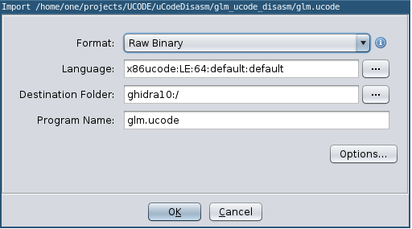

# Intel Atom Microcode - Ghidra Processor Module

[](https://zenodo.org/badge/latestdoi/376316556)

Ghidra Processor Module to disassemble and decompile the x86 Intel Atom microcode provided in [chip-red-pill/uCodeDisasm](https://github.com/chip-red-pill/uCodeDisasm).


## Install and Run
This module has been tested on Ghidra from `9.2` to `10.1.5`.

1. Clone this repo in `<ghidra install dir>/Ghidra/Processors/`
2. `git clone https://github.com/chip-red-pill/uCodeDisasm`  and copy `lib/txt2ghidra.py` from this repo to the `uCodeDisasm` folder.
3. run `./txt2ghidra.py ../ucode/`, that will produce a `glm.ucode` binary file (or what specified by the `-o <outfile.ucode>` option). `../ucode/` must be the folder that contains the dumps `ms_array0.txt, ms_array1.txt, ms_array0.txt`
4. Run Ghidra and load `glm.ucode` selecting `x86ucode` as Language for the binary as shown in the screenshot:
   
    


## Details

From [chip-red-pill/uCodeDisasm](https://github.com/chip-red-pill/uCodeDisasm):
> The microcode of the Intel Atom CPUs consists from two large chunks of data – Microcode Triads and Sequence Words. These data are kept in the ROM area of a functional block inside CPU core that is called Microcode Sequencer (MS).

We encourage to read the `uCodeDisasm` readme and source code to understand ucode internals mechanisms.

### Addressing

The `txt2ghidra.py` simply packs together Microcode Triads and Sequence words into 16-bytes ucode instructions that will be analyzed by our Ghidra Processor Module. During the process it additionally transforms and inserts metadata into the instructions to make ghidra's life easier.

Since instructions are now 16 bytes long and Ghidra does not currently support word sizes bigger than 8 bytes, the ucode address scheme in Ghidra is different from what one would expect from reading the `uCodeDisasm` repo, and all the code addresses must be multiplied by 0x10.

For example, `cpuid_xlat` is at address 0x0be0 in the originally published ucode, while at address 0x0be00 in Ghidra (see Screenshot).

### Instructions

Each ghidra instruction will be composed by a microcode instruction and possibly by a sequence word, that either influences control flow after the instruction execution (`eflow`), or sets up some of synchronization before execution (or both).

### Functions

`chip-red-pill/uCodeDisasm` already identified and named lot of functions inside the dumped code. All of these symbols are automatically loaded in Ghidra. The autoanalysis starts from these defined functions and performs recursive disassembly. To disassemble code not reached by the autoanalysis, press `D`. Then press `F` to define function starting from the address under the cursor, that will be analysed and decompiled.

### ucode patches
The decompiler supports decrypted ucode patches. To generate an ucode blob with a patch applied pass `-p <PATCH_FILE>` to `txt2ghidra.py`.
The `PATCH_FILE` must be in the format:
```
0000:  000000000000 00003ecb3a3b 00003eb96ef7 00003e8c6217 -
[...]                                                       | match & patch
001c:  00003e9f31a5 00003efb758f 000000000000 000000000000 -
0000:  c0053d03ffc8 4152f45c027f c21e0303d23d 000000000000 -
[...]                                                       | ucode RAM
01fc:  000000000000 000000000000 000000000000 000000000000 -
0000:  0000070000ce 000018201a50 000018201a50 0000384c0600 -
[...]                                                       | seqword RAM
007c:  000031805140 000011fc9192 000031f59040 000000000000 -
```

The patches will be shown in the decompilers as conditionals statements under the condition `if (PATCH_ENABLED() != 0) { [...] }` to show both the patch and the original instructions.

## Open Problems

Most of the instructions' semantics is correctly defined, and decompilation should generally work.  
There are a few remaining open problems to tackle. PR and issues to discuss them are welcomed.

- We identify function calls as instructions doing `saveuip + jmp` (usually combining instructions and sequence words), but this may not always be true.
- How do function calls take parameters and return values? Seems a mix of temporary registers, but not always the same registers.
- There is still unclear semantics on some operations (uflow uret parameters meaning, segment selectors packing, ...) marked by `TODO` in the `.slaspec` file

There is also some missing implementation details: 

- All registers are assumed to be 64 bits, which is in general false. Disassembled instruction include the operand size, but not the decompiled view.
- No SSE/AVX instruction is currently supported.
- Temporary register aliasing is not modeled (`ROVR`).
- Indirect jumps are rarely resolved by ghidra.
- Functions return using jumps trough the `UIP0/1` register (see (`uCodeDisasm`)[https://github.com/chip-red-pill/uCodeDisasm]) which decreases decompilation quality.
